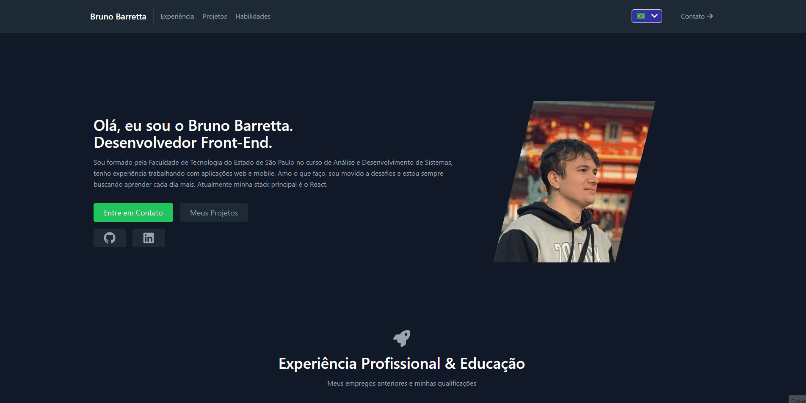

# Portfólio 

Projeto pessoal destinado a compartilhar meu conhecimento, ideias, conquistas e objetivos. Construído com React, utilizei a Context API para gerenciamento de estados globais, i18n para internacionalização e Tailwind CSS para proporcionar uma experiência de usuário fluída. Explore um pouco do meu universo neste aplicativo!

## Demonstração da Aplicação



## Tecnologias Utilizadas

- [React](https://reactjs.org/): Biblioteca JavaScript para construção de interfaces de usuário.
- [Vite](https://vitejs.dev/): Vite é um framework de desenvolvimento web extremamente rápido para projetos em React.
- [Tailwind CSS](https://tailwindcss.com/): Uma estrutura de design de utilitários CSS de baixo nível.
- [Context API](https://reactjs.org/docs/context.html): API do React para gerenciar o estado global da aplicação.
- [i18n](https://www.i18next.com/): Biblioteca para internacionalização em JavaScript.

## Pré-requisitos

Certifique-se de ter as seguintes ferramentas instaladas antes de prosseguir:

- [Node.js](https://nodejs.org/)
- [npm](https://www.npmjs.com/)

## Instalação

1. Clone o repositório:

```bash
git clone https://github.com/brunobarretta/portfolio.git
```


2. Navegue até o diretório do projeto:

```bash
cd portfolio
```

3. Instale as dependências:

```bash
npm install
```

## Uso

Inicie o servidor de desenvolvimento:

```bash
npm run dev
```

## Licença

Este projeto é licenciado sob a [Licença MIT](LICENSE).

## Créditos

Projeto desenvolvido por [Bruno Barretta](https://github.com/brunobarretta).
